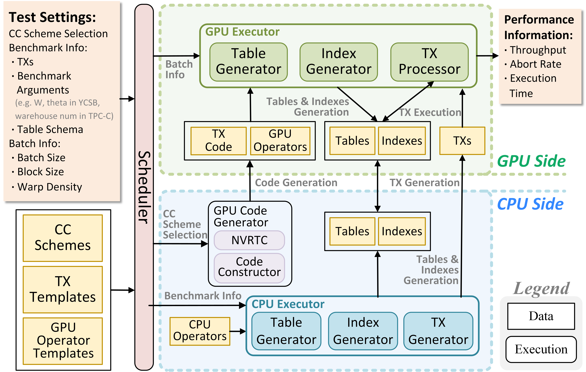

# gCCTB

## :dizzy:Overview

gCCTB is a testbed designed to evaluate various concurrency control schemes in GPU environments comprehensively. 
gCCTB allows for easy and efficient testing of different CC schemes on GPUs using a variety of benchmarks under different configurations.

<p align="center">

</p>

## :balloon:Features

### Supported CC Schemes

|Scheme|Name|GPU Oriented|Latch Version|
|---|---|---|---|
|2PL no-wait|tpl_nw|N|slow_tpl_nw|
|2PL wait-die|tpl_wd|N|slow_tpl_wd|
|TO|to|N|slow_to|
|MVCC|mvcc|N|slow_mvcc|
|Silo|silo|N|slow_silo|
|TicToc|tictoc|N|slow_tictoc|
|GaccO|gacco|Y||
|GPUTx|gputx|Y||

### Metrics

|Metrics|Unit|Measured On|
|---|---|---|
|Throughput|Tx/s|CPU
|Total Number of Rollbacks||CPU|
|Average Total Duration|s|CPU|
|Average Precompute Duration|s|CPU|
|Average GPU Duration|s|CPU|
|Average GPU Duration|ms|GPU|
|Average Timestamp Allocation Duration|ms|GPU|
|Average Waiting Duration|ms|GPU|
|Average Aborting Duration|ms|GPU|
|Average Manager Duration|ms|GPU|
|Average Index Duration|ms|GPU|

### Requirements

- NVIDIA GPU with compute capability 8.9
- CUDA 12.0
- Python3

## :wrench:Build

```
python3 compile.py
```

## :rocket:Useage

### Dataset Generation
```
# format
./out/gen_ycsb {ycsb_rownum} {ycsb_txcnt} {theta} {r_ratio} {path_to_dataset}
# example
./out/gen_ycsb 10485760 1048576 0.1 0.9 ./dataset/ycsb.txs
```
where $theta \in [0,1.0], r\_ratio \in [0,1.0]$

### Benchmark
```
# format
./out/test_ycsb {path_to_dataset} {ycsb_rownum} {ycsb_txcnt} {cc_scheme} {warp_density} {block_size} {batch_size} {debug_flag}
# example
./out/test_ycsb ./dataset/ycsb.txs 10485760 1048576 tpl_nw 5 32 65536 0
```

where $warp\_density \in [0,5], block\_size \in [0,32]$

### Output Explanation

```
{cc_scheme} {warp_density} {block_size} {batch_size} {throughput} {tot_abort_cnt} {avr_abort_cnt} {avr_ts_d} {avr_wait_d} {avr_abort_d} {avr_mng_d} {avr_tot_d} {avr_idx_d} {avr_pre} {avr_proc} {avr_tot}
```
where `avr_tot_d` corresponds to the `Average GPU Duration` measured on GPU, `avr_proc` corresponds to the `Average GPU Duration` measured on CPU, `avr_tot` corresponds to the `Average Total Duration`.

## :floppy_disk:Experiment Data

Experiment data is listed in `out_data` directory.

## :dart:TODO

- More Indexes

## :open_book:Related Projects

### [DBx1000](https://github.com/yxymit/DBx1000) 

Xiangyao Yu, George Bezerra, Andrew Pavlo, Srinivas Devadas, and Michael Stonebraker. 2014. Staring into the abyss: an evaluation of concurrency control with one thousand cores. Proc. VLDB Endow. 8, 3 (November 2014), 209–220. https://doi.org/10.14778/2735508.2735511

### [CCBench](https://github.com/thawk105/ccbench)

Takayuki Tanabe, Takashi Hoshino, Hideyuki Kawashima, and Osamu Tatebe. 2020. An analysis of concurrency control protocols for in-memory databases with CCBench. Proc. VLDB Endow. 13, 13 (September 2020), 3531–3544. https://doi.org/10.14778/3424573.3424575